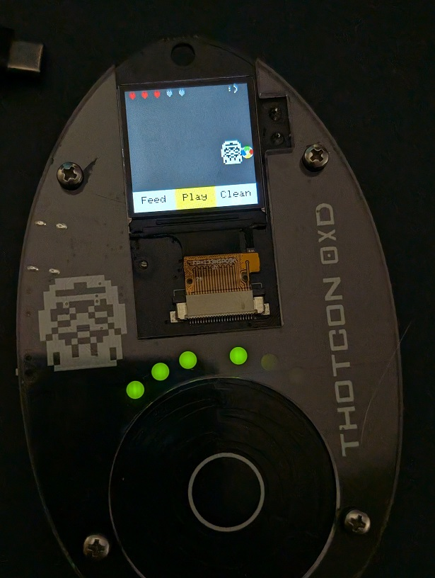

# 🐾 Thotagotchi – ThotCon 0xD 2025 Badge Pet Game

A virtual pet game built for the 2025 ThotCon 0xD badge, powered by an ESP32 and featuring an LCD screen, touch scroll wheel and buzzer. 

Keep your Trooper happy by feeding, playing, and cleaning up after it — or face the consequences.



## Features

- 🐾 Animated pet Trooper
- 💩 Poop (and cleaning!)
- 🍗 Feeding interaction
- 🏐 Ball play with collision physics
- ☠️ Death
- 🔊 Buzzer sound effects (non-blocking)
- 💡 LED hunger meter
- 🎨 HUD with health indicators
- 🕹️ Touch wheel controls
- 🖥️ Bitmap rendering with scalable 1-bpp graphics

## Controls

Use the touch wheel:

| Gesture | Action |
|---------|--------|
| Left    | Feed |
| Down    | Play |
| Right   | Clean |
| Center  | Confirm |
| Up + Center | Toggle movement mode (Wander / DVD Bounce) |


---

## Hardware Requirements

- ESP32 Dev Board (ThotCon 0xD Badge spec or equivalent)
- ST7789 TFT 240x240 SPI screen (see User_Setup.h below)
- Buzzer (GPIO 5)
- 6 LEDs for hunger meter (GPIOs: 21, 22, 19, 17, 16, 25)
- Touch wheel (capacitive touch pins 12, 13, 14)
- Center select (touch pin 27)

---

## Flashing Instructions (PlatformIO)

1. **Clone the repo:**

    ```bash
    git clone https://github.com/gigawatts/thotagotchi.git
    cd thotagotchi
    ```
2. **Modify the User_Setup.h file for the TFT (see below).**

3. **Install [PlatformIO](https://platformio.org/) for VSCode** (or use the CLI).

4. **Build and upload:**

    ```bash
    pio run -t upload
    ```


## TFT_eSPI Setup

To use the ST7789 screen, edit your User_Setup.h in the TFT_eSPI library folder:

File to modify (create if it doesn't exist):

```bash
.pio/libdeps/esp32dev/TFT_eSPI/User_Setup.h
```

```cpp
#define ST7789_DRIVER
#define TFT_MOSI 23
#define TFT_SCLK 18
#define TFT_CS   15
#define TFT_DC    2
#define TFT_RST   4
#define TFT_RGB_ORDER TFT_BGR
#define TFT_WIDTH 240
#define TFT_HEIGHT 240
#define TFT_COLOR_DEPTH 8

#define LOAD_GLCD
#define LOAD_FONT2
#define LOAD_FONT4
#define LOAD_FONT6
#define LOAD_FONT7
#define LOAD_FONT8
#define LOAD_GFXFF
#define SMOOTH_FONT

#define SPI_FREQUENCY  40000000
#define SPI_READ_FREQUENCY 20000000
#define DISABLE_ALL_LIBRARY_WARNINGS
```
---

## Notes

- Game states are persistent only in RAM.
- The pet can die if ignored too long (max hunger + zero happiness).
- To restart, press the physical **reset button** on the left side of the badge.

---

## Project Structure

```vbnet
thotagotchi/
├── data/             ← Optional SPIFFS files
├── include/
│   └── pet_sprites.h ← All sprite bitmaps
├── lib/              ← External libraries (optional)
├── src/
│   └── main.cpp      ← Game logic and rendering
├── platformio.ini    ← PlatformIO config
└── README.md         ← You're here

```

---

## Pin Map

| Function      | GPIO | Notes                      |
|---------------|------|----------------------------|
| Buzzer        | 5    | Active HIGH                |
| Select Touch  | 27   | Center select button       |
| Touch Q1      | 13   | Capacitive wheel segment 1 |
| Touch Q2      | 12   | Capacitive wheel segment 2 |
| Touch Q3      | 14   | Capacitive wheel segment 3 |
| LED 1–6       | 21–25| Hunger bar, left to right  |
| LCD (ST7789)  | SPI  | MOSI = 23, SCLK = 18, CS = 15, DC = 2, RST = 4 |


---

## License

MIT License.  
© 2025 Kujo – Made for ThotCon 0xD
